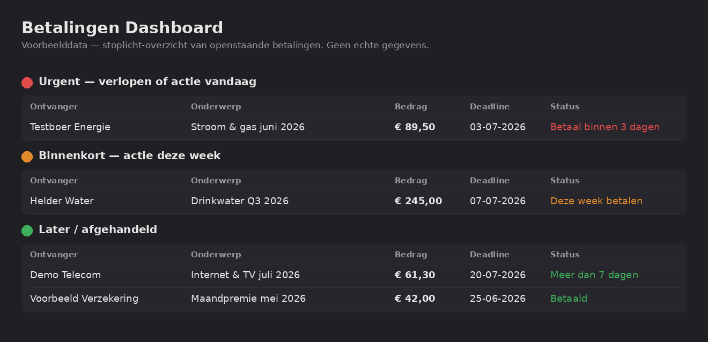

# Personal AI Command Center — Telegram Intake Agent

> **Status (September 2026): retired.** The Telegram route ran from late June to the end of
> July 2026. I switched it off because capturing through Telegram was clumsy for me day to
> day. Photos and notes now go from my phone into a Drive folder, and a small local script
> moves them into the knowledge base, where the same classify → store → act steps still run.
> This repo stays online as the first version, and as a record of what I learned building it.

> A personal automation that captures input from Telegram, classifies it with AI, and
> stores it as structured Markdown in a knowledge base — then turns incoming admin
> (invoices, bills, deadlines) into a live, colour-coded action dashboard.

Built as a learning project on the path to junior AI & IT Consultant. Every part of it
maps to a pattern small businesses need: capture → classify → store → act, with a human
in the loop.

---

## What it delivers

Running against my own admin, day to day — in plain terms:

- **Weekly admin went from a scramble to a ~15-minute review.** One command regenerates the
  dashboard; I read the top of the page and act, instead of hunting through documents.
- **Nothing slips through.** Every bill lands with sender, amount, and due date already
  extracted and colour-coded by urgency — I no longer discover an expired invoice by accident.
- **One number, one place.** Shared household costs live in a single source-of-truth file, so
  the split total is always right and never double-counted across notes.
- **Capture from anywhere.** A photo of a receipt from my phone is filed and confirmed in
  seconds, without opening a laptop.

The transferable claim: *I built this for myself, it runs daily, and I can build a version of
it for a business.*

---

## The problem

- Information gets lost between conversations, sessions, and devices.
- Filing documents and ideas by hand is slow and inconsistent.
- There is no single place that tracks what actually needs action — which bill is due,
  when, and how much.

## The solution

Send anything to a Telegram bot (text, photo, or file). An automation routes it, an AI
classifies it, and it lands as a structured Markdown note in a knowledge base. When the
input is an invoice or bill, it flows into an **administration dashboard** that shows, at
a glance, what needs paying and how urgent it is — using a traffic-light system.

---

## Architecture

```
[Telegram bot]  ── user sends text / photo / file   (capture from anywhere)
      │
      ▼
[n8n Cloud — routing layer]            write-only to the intake folder
      │  If-node: text or binary?
      ├── text   ──► Claude (classify) ──► Create file from text
      └── binary ──► Upload file
      │
      ▼
[Google Drive — intake landing zone]   /raw/Inbox  (mobile capture + sync)
      │
      │  bridge pulls new intake down to the local machine
      ▼
[Local runtime — ~/AI-OS on my Mac]    the system of record (Obsidian + Claude Code)
      │
      ▼
[Processing]  ── scheduled (launchd) + on demand; routes sources, updates the base
      │           (Claude reads photos natively here — no separate OCR)
      ├──► knowledge pages (notes, concepts, people, projects)
      ├──► admin dashboard (payments, deadlines, shared costs)
      └──► consolidation pass (cross-links, dedupe, index)
      │
      ▼
[Telegram — confirmation back to user]
```

> **Local-first (since July 2026).** The runtime is the local `~/AI-OS/` folder on my Mac —
> Obsidian and Claude Code both operate directly on the same Markdown files. Google Drive is
> no longer the runtime; it's the mobile-capture landing zone and backup. A small bridge pulls
> new intake from Drive down to the local machine, where all processing happens. This removed
> the reliability problems of running automation against a synced cloud folder and made
> scheduled, unattended runs possible.

### Tool roles

| Tool | Role |
|------|------|
| **Telegram** | Mobile input interface. Send text, photos, or files from anywhere; receive confirmations back. |
| **n8n** | Automation routing layer. Receives the webhook, decides text vs binary, writes to storage, sends confirmation. No business logic — pure routing. |
| **Claude (Anthropic)** | Intake classifier. Reads content, assigns a type, decides the destination, writes structured Markdown. Proposes; does not execute. |
| **Google Drive** | Intake landing zone. n8n writes new captures to a single inbox folder; a bridge pulls them down to the local machine. No longer the runtime — legacy/backup + mobile sync. |
| **Local runtime (`~/AI-OS`)** | The system of record. Obsidian and Claude Code operate directly on local Markdown; all processing and knowledge live here. |
| **launchd (macOS)** | Scheduler. Runs inbox processing and the consolidation pass on a fixed cadence, unattended, with a kill-switch to pause everything. |
| **Processing (Claude Code)** | Reads the inbox, routes each item to the right place, creates/updates knowledge and admin pages. Runs on a schedule (launchd) and on demand — human-in-the-loop. |
| **Markdown / Obsidian** | The knowledge base and its viewer. All knowledge lives as Markdown files. |

---

## Features

- ✅ Text intake via Telegram
- ✅ AI classification (type, destination, rationale) using Claude
- ✅ Structured Markdown output with standard sections
- ✅ Photo & file intake — routed and stored to the inbox
- ✅ Image content read by Claude during supervised processing (native vision — no separate OCR)
- ✅ Admin dashboard with a traffic-light system for payments
- ✅ Telegram confirmation after each intake
- ✅ Human-in-the-loop: the AI classifies and proposes; a human approves
- ✅ Scheduled, unattended inbox processing (launchd) with a kill-switch
- ✅ Nightly consolidation pass ("Daily Brain Rewire") — links, dedupe, index
- 🔄 Voice notes (transcription) — planned
- 🔄 Ask questions against the knowledge base via Telegram — planned
- 🔄 Calendar integration (read-only first, then reminders) — planned

---

## The admin dashboard (traffic-light system)

The core of the everyday value. When an invoice or bill is ingested, the AI extracts the
sender, subject, amount, and due date, and places it on a payments dashboard grouped by
urgency. Each obligation carries a single status colour:

| Colour | Meaning |
|--------|---------|
| 🔴 **Red** | Expired, due today, or within 3 days — act now |
| 🟠 **Orange** | Due within 7 days — action this week |
| 🟢 **Green** | More than 7 days away, or already paid — no action needed |



*Example data — the real dashboard contains private financial information and is never published.*

### Why grouping by urgency matters

A flat list of bills forces you to scan and calculate every time. Grouping by traffic
light means the top of the page is always "what is on fire today," and the rest can wait.
The colour is recalculated from the due date, so the dashboard re-sorts itself as
deadlines approach.

### The action workboard

Beyond the overview, a separate "today" workboard turns each urgent item into a
**self-contained card** so you never have to look anything up mid-task. Each card holds:

- **Action** — what to do
- **Status** — traffic light + a short description
- **Deadline** — when
- **Amount** — if financial
- **Payment link / website** — a direct link where possible
- **Source file** — which ingested document this came from
- **Notes** — context, caveats, related obligations
- **Checkboxes** — step-by-step sub-actions

This makes the workboard usable on its own during an actual admin session — no
cross-referencing five files.

### Shared costs — a single source of truth

Household costs that are split with someone else live in **one** dedicated file, and only
there. The rule "this amount appears in exactly one place" prevents the contradictions and
double-counting that creep in when the same number is copied across several notes. The
processing layer adds new shared bills to that file and recalculates the open total
automatically.

### Weekly admin routine

Once a week, a single command regenerates the dashboard: it re-reads recent documents,
recomputes every traffic light, lists open actions sorted by urgency, and prepares the
week's to-dos. Administration becomes a 15-minute review instead of a scramble.

---

## Knowledge consolidation — the system's "sleep"

Like a brain consolidating memories during sleep, the system runs a periodic
consolidation pass over the knowledge base. Instead of leaving notes as isolated islands,
this routine walks the collection to:

- find and add connections between related pages (cross-links),
- detect and merge duplicates,
- update the master index and activity log,
- surface gaps and open questions,
- prepare a focus for the next session.

This is what keeps the knowledge base **compounding** rather than merely growing: the
cross-references get richer over time, so a good answer is already half-written before the
question is asked. The approach follows the idea of an LLM-maintained wiki — the model
does the bookkeeping a human would eventually abandon.

*Status: automated — the consolidation pass and inbox processing now run unattended on a
schedule (launchd), and on demand.*

---

## Safety & privacy by design

The automation is deliberately constrained. These boundaries are documented, not implied.

**The AI may automatically:**

- Save input to the intake folder
- Classify normal input and create/update ordinary notes
- Add invoices to the dashboard as "assumed open"
- Propose reminders
- Answer questions using knowledge-base context
- Send intake confirmations via Telegram

**The AI must never automatically:**

- Make payments
- Send emails or external messages (other than Telegram confirmations)
- Delete files
- Modify core instruction files
- Make legal or financial decisions
- Publish private content
- Write to a calendar without confirmation

**Write boundary:** n8n may write **only** to the intake folder. It has no write access
anywhere else. All further routing happens in the supervised processing step.

**Credentials** live in n8n's credential store and are never committed. Any exported
workflow is sanitised (tokens and IDs replaced with placeholders) before publishing.

---

## Tech stack

| Tool | Role |
|------|------|
| Telegram | Mobile input interface |
| n8n | Automation routing |
| Claude (Anthropic) | AI classifier |
| Google Drive | File storage |
| Markdown / Obsidian | Knowledge base |

## Status

**v3 — local-first, with scheduled automation.** Text and photo/file intake live; admin
dashboard in daily use; inbox processing and the consolidation pass now run unattended on a
schedule (launchd), with a kill-switch. Runtime moved from the synced cloud folder to a
local `~/AI-OS/` on the Mac (July 2026). Known issues being worked on: filtering empty
messages, and standardising the generated Markdown formatting.

## Roadmap

**Done since v2**

- ✅ Scheduled, automated inbox processing (launchd).
- ✅ Automated consolidation pass (links, dedupe, index).
- ✅ Local-first runtime migration off the synced cloud folder.

**Next**

1. Filter empty messages (stability fix).
2. Voice notes (transcription).
3. Knowledge-base Q&A via Telegram.
4. Calendar integration (read-only first, then reminders).

## Lessons learned

- Start with the smallest MVP (text first), then add binary.
- An If-node is the right primitive for text-vs-binary routing.
- Telegram photo messages carry no `text` field — branch on message type and fetch the
  file separately, or photos produce empty files.
- No separate OCR node is needed: n8n stores the image, and the model reads it natively at
  the processing stage. Don't build plumbing the model already does for free.
- Filter empty messages **before** going live.
- A single-source-of-truth rule beats copying numbers between files.
- Human-in-the-loop isn't a limitation — it's a trust feature.

---

## Why this matters (transferable pattern)

This is not "AI as a chatbot." It integrates a chat interface, a workflow engine, an AI
model, cloud storage, and a supervised processing layer into one coherent pipeline — the
kind of multi-tool integration small businesses actually need.

The same skeleton — **capture → AI classify → store → act, human-in-the-loop** — deploys
directly as:

- Invoice intake and filing
- Customer-question routing
- Internal document classification
- An operations dashboard for back-office staff
- Lead intake and qualification

The story: *I built this for myself, it works, and I can build a version of it for you.*

---

## Screenshots

| Screenshot | What it shows |
|------------|---------------|
| `screenshots/admin-dashboard-voorbeeld.png` | Traffic-light payments dashboard — example data |
| `screenshots/workflow.png` | The n8n workflow: Telegram Trigger → If → Google Drive → Confirm |
| `screenshots/telegram-intake-photo.jpg` | Telegram bot receiving a test invoice photo and confirming intake |
| `screenshots/telegram-intake-water.jpg` | Same pipeline — water invoice (orange, deadline this week) |
| `screenshots/telegram-intake-energy.jpg` | Same pipeline — energy invoice (red, deadline expired) |

All screenshots use fictional example data. See [`screenshots/README.md`](screenshots/README.md) for details.

A rendered example dashboard is also in
[`examples/betalingen-dashboard-voorbeeld.md`](examples/betalingen-dashboard-voorbeeld.md).
