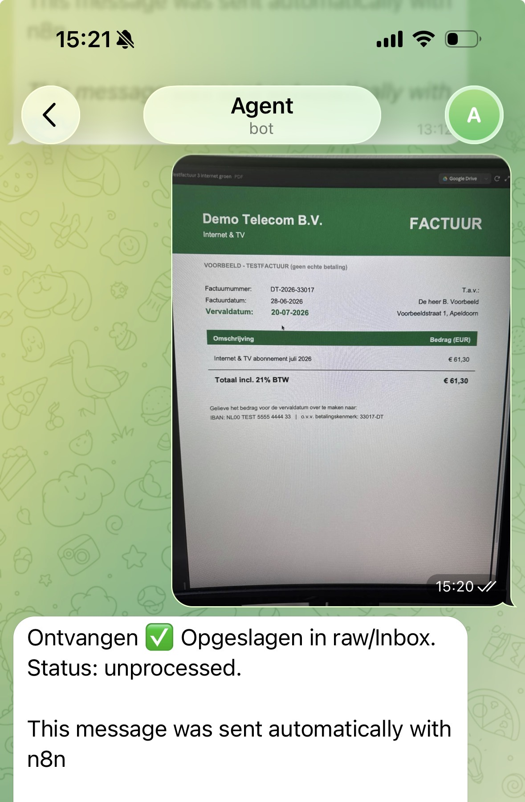

# Sample — Photo Intake

This is an example of how a photo or file sent to the Telegram bot is processed.

All data is fictional. No real invoices, personal information, API keys, or private documents are included.
The invoice shown is a clearly marked TESTFACTUUR (test invoice) with fictional provider names and addresses.

---

## What the user sends

A photo of an invoice — for example, the test invoice from "Demo Telecom B.V." sent in the Telegram chat:



*All data in this screenshot is fictional (VOORBEELD - TESTFACTUUR, geen echte betaling).*

---

## What n8n does

1. Telegram sends a webhook event — the message has **no** `text` field (photo messages carry only file metadata)
2. The If-node evaluates: `text` field present? → **false**
3. Routes to **Upload file** (Google Drive)
4. The binary file is uploaded to `raw/Inbox/` as `file_N.jpg`
5. Telegram sends a confirmation: `Ontvangen ✅ Opgeslagen in raw/Inbox. Status: unprocessed.`

---

## What supervised processing does

During the next Feed the Brain run:

1. Reads the image using AI vision (no separate OCR node needed)
2. Extracts: sender, subject, amount, due date
3. Classifies as `admin` → destination `raw/legal/`
4. Moves the file from `raw/Inbox/` to `raw/legal/`
5. Creates a wiki summary page
6. Adds the item to the admin dashboard:

```markdown
| Sender         | Subject              | Amount  | Due date   | Status          |
|----------------|----------------------|---------|------------|-----------------|
| Demo Telecom   | Internet & TV jul 26 | € 61,30 | 20-07-2026 | 🟢 On track     |
| Helder Water   | Drinking water Q3 26 | €245,00 | 07-07-2026 | 🟠 This week    |
| Testboer Energie | Power & gas jun 26 | € 89,50 | 03-07-2026 | 🔴 Act today    |
```

7. Logs the action in the activity log

---

## Why no OCR node

The AI model reads image files natively. Passing the image directly to the model during supervised processing gives better results than a dedicated OCR step, handles handwritten notes and non-standard layouts, and requires no extra infrastructure.

---

## Three test invoices — traffic-light demo

The three Telegram screenshots in `screenshots/` demonstrate all three traffic-light states:

| Screenshot | Provider | Amount | Deadline | Colour |
|------------|----------|--------|----------|--------|
| `telegram-intake-energy.jpg` | Testboer Energie (demo) | €89,50 | 03-07-2026 | 🔴 Expired |
| `telegram-intake-water.jpg` | Helder Water (demo) | €245,00 | 07-07-2026 | 🟠 This week |
| `telegram-intake-photo.jpg` | Demo Telecom (demo) | €61,30 | 20-07-2026 | 🟢 On track |

All three invoices are clearly marked "VOORBEELD - TESTFACTUUR (geen echte betaling)" — example/test invoice, no real payment.
